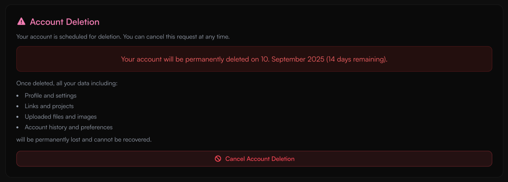
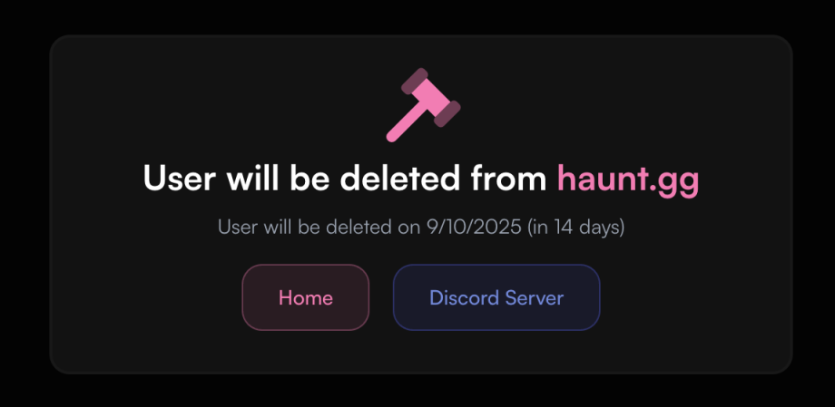

<Card title="Important Information" icon="circle-1" href="../guides/account-deletion#important-information-before-deleting-your-account" horizontal>
Learn what happens when you delete your account.
</Card>

<Card title="Delete Account" icon="circle-2" href="../guides/account-deletion#open-account-settings" horizontal>
Learn how to delete your account.
</Card>

## Important Information Before Deleting Your Account

- All of your data will be permanently deleted, including assets and any other stored information.  
- You have **14 days** to cancel the deletion process.  

<Danger>
Once your data has been deleted, it cannot be recovered.
</Danger>

---

## Deleting Your Account

<Steps>
<Step title="Open Account Settings">
Go to your Dashboard and navigate to [Account Settings](https://haunt.gg/dashboard/settings).
</Step>

<Step title="Delete Account">
Scroll down and click **Delete Account**.

<Warning>
Be sure to review the [important information](../guides/account-deletion#important-information-before-deleting-your-account) before confirming deletion.
</Warning>
</Step>

<Step title="Confirmation">
You're all set! Your account will be scheduled for deletion in **14 days**.  
If you change your mind, you can cancel the deletion at any time before the 14 days are up.
</Step>
</Steps>

<Frame>

</Frame>

<Frame caption="If this banner appears on a user’s profile, it indicates that their account is scheduled for deletion.">

</Frame>
