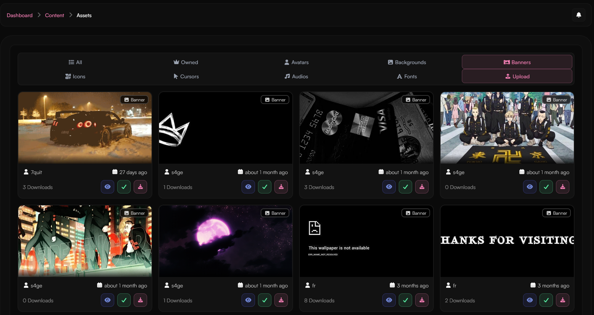

  <Card
    title="Preview & Apply Assets"
    icon="circle-1"
    href="../guides/custom-assets#previewing-and-applying-assets"
    horizontal
  >
    Learn how to preview and apply custom assets to your profile.
  </Card>
  <Card
    title="Asset Types"
    icon="circle-2"
    href="../guides/custom-assets#available-asset-types"
    horizontal
  >
    Explore the types of assets you can customize.
  </Card>
  <Card
    title="Upload Your Own Assets"
    icon="circle-3"
    href="../guides/custom-assets#uploading-your-own-assets"
    horizontal
  >
    Share your custom assets with the haunt.gg community.
  </Card>

## Previewing and Applying Assets

Each asset you upload or browse on haunt.gg has three key buttons:

- 👁 **Preview (Eye Icon)** – See what the asset looks like on your profile before applying it.
- ✅ **Apply (Green Checkmark)** – Instantly applies the asset to your profile.
- ⬇️ **Download (Download Icon)** – Saves the asset file to your device for personal use or editing.

<Frame caption="Asset UI showing the preview, apply, and download buttons">
  
</Frame>

<Info>
You must be logged in to apply custom assets to your profile.
</Info>

---

## Available Asset Types

<Steps>
  <Step title="Custom Backgrounds">
    Upload or select a background to personalize your profile. You can also browse community-submitted backgrounds from other users.
  </Step>

  <Step title="Profile Fonts">
    Choose from a variety of fonts to change the text font of your profile bio and username. Fonts submitted by other users are also available.
  </Step>

  <Step title="Custom Cursors">
    Add flair to your haunt.gg experience with unique cursor styles. These are visible to visitors of your profile.
  </Step>

  <Step title="Audio Tracks">
    Upload or select audio that plays when someone visits your profile. Community-shared audio is also available.
  </Step>

  <Step title="Avatars">
    Set a custom avatar that reflects your personality. You can also use avatars uploaded by other users.
  </Step>

  <Step title="Icons">
    Customize your interface and profile with icons. Icons can be shared and reused across the haunt.gg community.
  </Step>
</Steps>

---

## Uploading Your Own Assets

Want to contribute to the community? You can upload your own custom assets for others to use!

<Steps>
  <Step title="Go to the Upload Page">
    Visit the [Asset Upload Dashboard](https://haunt.gg/dashboard/assets).
  </Step>

  <Step title="Choose Asset Type">
    Select the type of asset you want to upload — like a background, font, cursor, audio file, avatar, or icon.
  </Step>

  <Step title="Upload Your File">
    Drag and drop your file into the upload box, or click to browse your device. Make sure your file matches the requirements for the asset type.
  </Step>
  
  <Step title="Finish Uploading">
    Click the upload/submit button. Once uploaded, your asset will be available in the public asset browser for others to preview, apply, or download.
  </Step>
</Steps>

<Info>
Do NOT upload anything that could be considered NSFW.
</Info>
